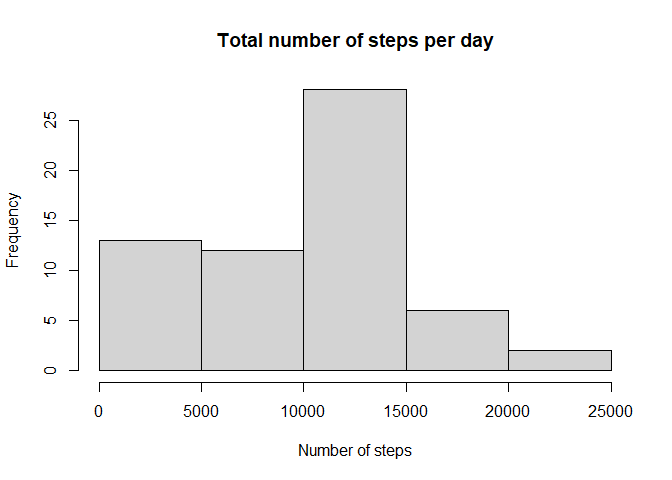
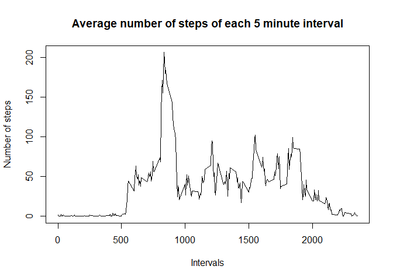
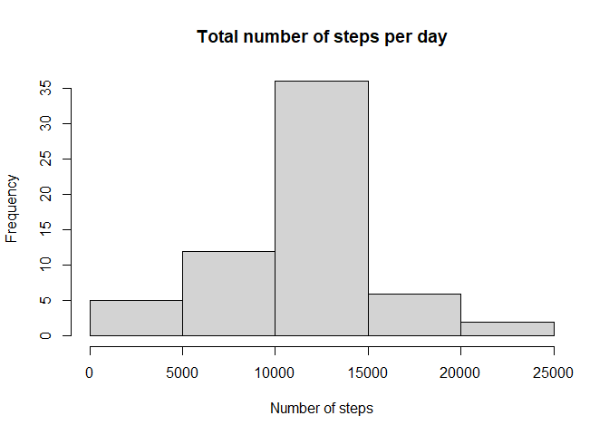
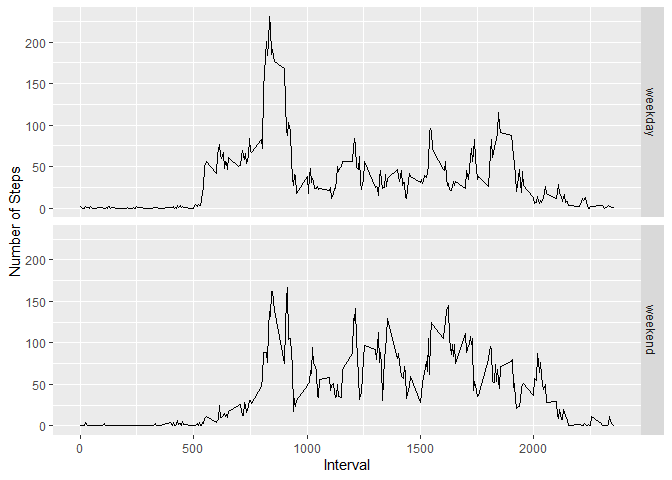

```r
knitr::opts_chunk$set(message = FALSE)
```

## Loading and preprocessing the data


```r
rm(list = ls())
library(tidyverse)
library(lubridate)

unzip("activity.zip")
activity <- read.csv("activity.csv")
activity <- mutate(activity, date = ymd(date))
```

## What is mean total number of steps taken per day?


```r
steps_day <- activity %>% group_by(date) %>%
        summarise(steps = sum(steps, na.rm = TRUE))

hist(steps_day$steps, main = "Total number of steps per day", xlab = "Number of steps")
```

<!-- -->

```r
mean(steps_day$steps)
```

```
## [1] 9354.23
```

```r
median(steps_day$steps)
```

```
## [1] 10395
```

## What is the average daily activity pattern?


```r
steps_interval <- activity %>% group_by(interval) %>%
        summarise(steps = mean(steps, na.rm = TRUE))
with(steps_interval, plot(x = interval, y = steps, type = "l",
                     main = "Average number of steps of each 5 minute interval", 
                     ylab = "Number of steps", xlab = "Intervals")
)
```

<!-- -->


```r
with(steps_interval, {
        maxIndex <- which(steps == max(steps))
        interval[maxIndex]
    }
)
```

```
## [1] 835
```

## Imputing missing values


```r
naIndexes <- !complete.cases(activity)
sum(naIndexes)
```

```
## [1] 2304
```

```r
intervalMean <- (activity %>% group_by(interval) %>%
        mutate(intervalMean = mean(steps, na.rm = TRUE)))$intervalMean

completeActivity <- activity
completeActivity$steps[naIndexes] <- intervalMean[naIndexes]
        
steps_day_complete <- completeActivity %>% group_by(date) %>%
        summarise(steps = sum(steps))

hist(steps_day_complete$steps, main = "Total number of steps per day", xlab = "Number of steps")
```

<!-- -->

```r
mean(steps_day_complete$steps)
```

```
## [1] 10766.19
```

```r
median(steps_day_complete$steps)
```

```
## [1] 10766.19
```


## Are there differences in activity patterns between weekdays and weekends?

```r
completeActivity <-  completeActivity %>% mutate(typeOfDay = factor((wday(date) %in% c(1, 7)), 
                          labels = c("weekday", "weekend")) )

steps_interval_typeOfDay <- completeActivity %>% group_by(interval, typeOfDay) %>%
        summarise(steps = mean(steps))

ggplot(data = steps_interval_typeOfDay, mapping = aes(x = interval, y = steps, group = typeOfDay)) +
        geom_line() +
        facet_grid(typeOfDay ~ .) + 
        labs(x = "Interval", y = "Number of Steps")
```

<!-- -->
